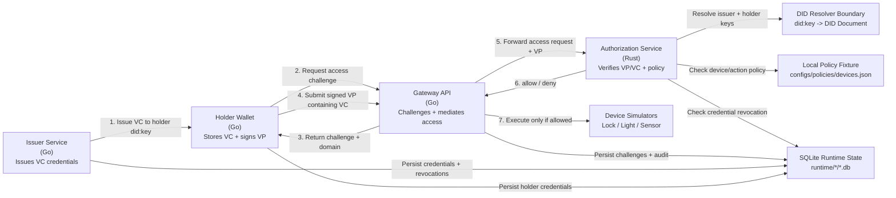

# SSI Smart Home Gateway PoC

## What this project is

This repository contains a **software-only proof of concept (PoC)** for a **gateway-based smart home architecture** that uses **Self-Sovereign Identity (SSI)** concepts to improve **user sovereignty** over device access and household data.

The main architectural choices are recorded in [ADR 0001: Gateway-Mediated SSI Proof of Concept](docs/adr/0001-gateway-mediated-ssi-poc.md).

The PoC is designed around five main components:

- **Gateway API:** receives access requests and mediates communication with devices
- **Authorization service:** evaluates credentials, revocation state, and local policy to return allow/deny decisions
- **Issuer service:** issues authorization credentials for users
- **Holder wallet service:** owns a holder `did:key`, stores credentials, and signs verifiable presentations
- **Device simulators:** emulate smart home devices such as locks, lights, and sensors

The main architectural goal is to demonstrate that **smart devices do not need to implement SSI directly**. Instead, a **locally controlled gateway** handles identity and authorization logic on their behalf.

---

## Project status

This repository is a PoC. It is intended to demonstrate the architecture, security flow, and evaluation scenarios, not to serve as production smart-home infrastructure.

The completed scope includes credential issuance, holder wallet presentations, gateway-mediated authorization, delegation, revocation, ownership transfer, data-flow mediation, local policy enforcement, durable audit/runtime state, focused tests, all-device smoke checks, CI, and reproducible operational commands.

The remaining production-grade concerns are documented as future work: richer household policy semantics, authenticated policy administration, standards-aligned revocation lists, selective disclosure, production key storage, multi-gateway state replication, formal API specifications, and release-blocking performance baselines.

## Simple architecture diagram




## Completed scope

- Gateway-mediated SSI architecture with Go gateway, Go issuer, Go holder wallet, Rust authorization service, and Go device simulators.
- Owner control, delegation, revocation, ownership transfer, VP challenge/replay protection, and data-flow mediation scenarios.
- Lock, light, and sensor device adapters.
- VC-shaped credentials with DID issuers, holder subjects, credential status, and Ed25519 Data Integrity-style proofs.
- `did:key` resolution behind a DID document/resolver boundary for issuer and holder verification keys.
- Holder wallet storage and challenge-bound verifiable presentation signing.
- Durable SQLite-backed gateway challenges with expiry, subject/device/action binding, and one-time atomic consumption.
- Issuer-side delegation, revocation, and ownership-transfer operations that require challenge-bound owner VPs.
- SQLite-backed credentials, revocations, issuer challenges, delegations, ownership transfers, audit events, access attempts, device executions, sensor readings, wallet metadata, and wallet-held credentials.
- Local policy enforcement from `configs/policies/devices.json`, with `scenarios/policyctl` for fixture inspection and updates.
- Focused authorization, gateway, issuer, and wallet unit tests for critical SSI/security paths.
- Non-interactive all-device scenario smoke runner with device, flow, timeout, and JSON options.
- Repeatable scenario measurement runner.
- CI/check scripts that run Go formatting/tests/vet, Rust formatting/check/clippy/tests, and all-device smoke validation.

---

## Testing

The PoC is composed of local services:

- **Authorization service (Rust)**  
- **Gateway API (Go)**  
- **Issuer service (Go)**  
- **Holder wallet service (Go)**  
- **Device simulators (Go)**  

The recommended way to test the current PoC is to use the top-level check script for automated checks, the smoke runner for non-interactive end-to-end validation, or the scenario orchestrator for manual exploration.

### Prerequisites

Make sure the following tools are available locally:

- `go`
- `cargo`
- `sqlite`

Also run all commands from the **repository root**, unless noted otherwise.

### Build checks

Run all standard checks from the repository root:

```bash
make check
```

This runs Go formatting, tests, and vet across all Go modules, plus Rust formatting, `cargo check`, `cargo clippy`, and `cargo test`.

To include the non-interactive all-device scenario smoke run:

```bash
make smoke
```

Useful smoke options:

```bash
go run ./scenarios/smoke -device all
go run ./scenarios/smoke -device sensor -flow vp-challenge
go run ./scenarios/smoke -device lock -flow delegation -json
```

### Final Validation

Before archiving, tagging, or handing off the PoC, run:

```bash
make check
make smoke-all
```

These commands exercise the full local validation surface: unit checks, Rust linting, and all-device scenario smoke coverage.

### Policy and Measurements

List the local policy fixture:

```bash
make policy-list
```

Update a device allowlist:

```bash
go run ./scenarios/policyctl -device light-living-room -actions turn_on,turn_off
```

Run a repeatable scenario measurement:

```bash
make measure
go run ./scenarios/measure -device sensor -flow vp-challenge -n 25
```

Reset runtime databases and scenario logs:

```bash
make reset
```

## Service endpoints

The services expose small JSON HTTP APIs for the PoC scenarios.

Gateway API:

* `GET /health`
* `POST /access/challenge`
* `POST /access/request`

Authorization service:

* `GET /health`
* `POST /v1/authorize`

Issuer service:

* `GET /health`
* `POST /credentials/challenge`
* `POST /credentials/owner`
* `POST /credentials/delegation`
* `POST /credentials/revoke`
* `POST /credentials/transfer`

Holder wallet:

* `GET /health`
* `GET /wallet/did`
* `POST /wallet/credentials`
* `POST /wallet/presentations`

Device simulators:

* `GET /health`
* lock: `POST /lock`, `POST /unlock`
* light: `POST /turn_on`, `POST /turn_off`
* sensor: `GET /reading?device_id=...`

### Using the orchestrator

First, sync the Go workspace:

```bash
go work sync
```

Then start the orchestrator:

```bash
go run ./scenarios/orchestrator
```

You should see a menu:

```text
1) Show status / health
2) Use devices
3) Test flows
4) Quit
```

### What the orchestrator does

The orchestrator starts these local processes:

* `gateway/rust-authz`
* `devices/lock-sim`
* `devices/sensor-sim`
* `devices/light-sim`
* `gateway/go-api`
* `issuer/go-issuer`
* `holder/go-wallet`

It also runs the implemented end-to-end scenarios against the live HTTP services.

### Orchestrator logs

When services are started by the orchestrator, logs are written under:

```text
scenarios/.logs/
```

These logs are runtime output and are intentionally ignored by git.

### Runtime databases

Security and scenario state is stored in local SQLite databases:

```text
GATEWAY_DB_PATH=runtime/gateway/gateway.db
ISSUER_DB_PATH=runtime/issuer/issuer.db
WALLET_DB_PATH=runtime/wallet/wallet.db
```

The orchestrator sets these paths for managed services. The services create their schemas on startup.

`gateway.db` contains:

* `access_challenges`
* `audit_events`
* `access_attempts`
* `device_executions`
* `sensor_readings`

`issuer.db` contains:

* `credentials`
* `credential_scopes`
* `issuer_challenges`
* `revocations`
* `delegations`
* `ownership_transfers`

`wallet.db` contains:

* `credentials`
* `wallet_metadata`
* `key_metadata`

### Expected scenario outcomes

#### Owner control

* an owner credential is issued
* the owner requests `unlock`
* the request is allowed
* expected reason: `allowed_by_owner_credential`

#### Delegation

* an owner credential is issued
* the owner signs an issuer challenge-bound VP proving control of the owner credential
* a delegated credential is issued for another subject
* delegated `unlock` is allowed
* delegated `lock` is denied
* expected deny reason: `action_out_of_scope`

#### Revocation

* a delegated credential is issued and works before revocation
* the owner signs an issuer challenge-bound VP authorizing the revocation
* the issuer revokes that delegated credential
* the same delegated request is denied afterward
* expected deny reason: `credential_revoked`

#### Ownership transfer

* an owner credential works before transfer
* the owner signs an issuer challenge-bound VP authorizing transfer
* the issuer revokes the previous owner credential and issues a replacement owner credential
* the previous owner is denied afterward
* the new owner is allowed afterward

#### VP challenge

* the holder wallet exposes a holder `did:key`
* an owner credential is issued to that holder DID
* the gateway issues a challenge and domain
* the wallet signs a verifiable presentation containing the credential
* the authorization service resolves issuer and holder `did:key` values and verifies both proofs
* replaying the same presentation challenge is denied
* expected reason: `allowed_by_owner_credential`

### SSI flow

The VP challenge flow follows this shape:

```text
Issuer -> Holder wallet: issue VC to holder did:key
Holder wallet -> Gateway: request device access challenge
Gateway -> Holder wallet: return challenge + domain
Holder wallet -> Gateway: submit signed VP containing the VC
Gateway -> Authorization service: forward access request + VP
Authorization service: resolve issuer/holder did:key values, verify VC + VP proofs, check revocation and policy
Gateway -> Device simulator: execute command only after allow
```

The gateway stores VP challenges durably in `gateway.db` with subject, device, action, domain, expiry, and consumption metadata. Challenge values are unique, and consumption is an atomic database update, so replaying the same VP challenge is denied even after process restart.

### Version-control hygiene

The repository tracks source code, lockfiles, policy fixtures, and empty fixture directories. It intentionally ignores generated local state:

* Rust build output under `gateway/rust-authz/target/`
* Orchestrator logs under `scenarios/.logs/`
* Runtime SQLite databases and WAL/SHM files under `runtime/`

To reset runtime state between manual scenario runs, use `make reset`. The seed policy fixture under `configs/policies/` is kept in version control.

### Known limits

This PoC intentionally does not provide:

* production wallet/key storage or recovery
* full VC Data Integrity canonicalization
* selective disclosure
* DID methods beyond local `did:key`
* standards-aligned Status List revocation
* authenticated runtime policy administration
* multi-gateway challenge/state replication
* distributed state storage
* formal OpenAPI specifications
* release-blocking performance thresholds

### Notes

* The orchestrator uses `127.0.0.1` for service URLs to avoid local IPv6 `localhost` issues on some systems.
* The current automated test flow covers **owner control**, **delegation**, **revocation**, **ownership transfer**, **data-flow mediation**, and **VP challenge**.
* This project is closed as a PoC; future productionization should start from a new plan or ADR rather than expanding the demo scope indefinitely.
