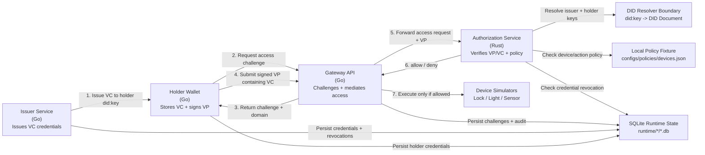

# SSI Smart Home Gateway PoC

## What this project is

This repository contains a **software-only proof of concept (PoC)** for a **gateway-based smart home architecture** that uses **Self-Sovereign Identity (SSI)** concepts to improve **user sovereignty** over device access and household data.

The main architectural choices are recorded in [ADR 0001: Gateway-Mediated SSI Proof of Concept](docs/adr/0001-gateway-mediated-ssi-poc.md).

The PoC is designed around five main components:

- **Gateway API (Go):** receives access requests and mediates communication with devices
- **Authorization service (Rust):** evaluates credentials, revocation state, and local policy to return allow/deny decisions
- **Issuer service (Go):** issues authorization credentials for users
- **Holder wallet service (Go):** owns a holder `did:key`, stores credentials, and signs verifiable presentations
- **Device simulators:** emulate smart home devices such as locks, lights, and sensors

The main architectural goal is to demonstrate that **smart devices do not need to implement SSI directly**. Instead, a **locally controlled gateway** handles identity and authorization logic on their behalf.

---

## Simple architecture diagram




## Implemented / To be implemented

### Already implemented

- Initial PoC architecture and service split
- First end-to-end vertical slice for **owner control**
- Initial **owner credential issuance** endpoint in the issuer
- Initial **authorization** endpoint in the Rust authz service
- Initial **gateway access request** endpoint
- First device simulator (**lock-sim**) and gateway-mediated lock control
- **Delegation** credential support and delegated access flows
- **Revocation** support and revocation-aware authorization
- **Ownership transfer** flows
- Additional device simulators and adapters (**light**, **sensor**)
- Data-flow mediation/redirection for compatible devices
- Audit logging and authorization traceability
- Scenario runners for all evaluation scenarios
- VC-shaped SSI credentials with DID issuers, holder subjects, credential status, and Ed25519 Data Integrity proofs
- `did:key` resolution behind a DID document/resolver boundary for issuer and holder verification keys
- Holder wallet and challenge-bound verifiable presentation flow
- Durable SQLite-backed VP challenges with expiry, subject/device/action binding, and one-time atomic consumption
- Issuer-side delegation, revocation, and ownership-transfer operations require challenge-bound owner VPs
- SQLite-backed credentials, revocations, audit events, device executions, sensor readings, and wallet state

### To be implemented

- Local policy management and richer household rules
- Automated regression tests and performance measurements
- API documentation, scripts, and CI workflows

---

## Testing

The PoC is composed of local services:

- **Authorization service (Rust)**  
- **Gateway API (Go)**  
- **Issuer service (Go)**  
- **Holder wallet service (Go)**  
- **Device simulators (Go)**  

The recommended way to test the current PoC is to use the **scenario orchestrator**, which can start the local services and run the implemented scenarios from an interactive menu.

### Prerequisites

Make sure the following tools are available locally:

- `go`
- `cargo`
- a C toolchain for the Go SQLite driver

Also run all commands from the **repository root**, unless noted otherwise.

### Build checks

Run the Go modules from their module directories:

```bash
(cd issuer/go-issuer && go test ./...)
(cd gateway/go-api && go test ./...)
(cd holder/go-wallet && go test ./...)
(cd scenarios && go test ./...)
```

Run the Rust authorization service checks from its package directory:

```bash
(cd gateway/rust-authz && cargo check)
```

### Using the orchestrator

First, sync the Go workspace:

```bash
go work sync
```

Then start the orchestrator:

```bash
go run ./scenarios/orchestrator
```

You should see a menu:

```text
1) Show status / health
2) Use devices
3) Test flows
4) Quit
```

### What the orchestrator does

The orchestrator starts these local processes:

* `gateway/rust-authz`
* `devices/lock-sim`
* `devices/sensor-sim`
* `devices/light-sim`
* `gateway/go-api`
* `issuer/go-issuer`
* `holder/go-wallet`

It also runs the implemented end-to-end scenarios against the live HTTP services.

### Orchestrator logs

When services are started by the orchestrator, logs are written under:

```text
scenarios/.logs/
```

These logs are runtime output and are intentionally ignored by git.

### Runtime databases

Security and scenario state is stored in local SQLite databases:

```text
GATEWAY_DB_PATH=runtime/gateway/gateway.db
ISSUER_DB_PATH=runtime/issuer/issuer.db
WALLET_DB_PATH=runtime/wallet/wallet.db
```

The orchestrator sets these paths for managed services. The services create their schemas on startup.

`gateway.db` contains:

* `access_challenges`
* `audit_events`
* `access_attempts`
* `device_executions`
* `sensor_readings`

`issuer.db` contains:

* `credentials`
* `credential_scopes`
* `issuer_challenges`
* `revocations`
* `delegations`
* `ownership_transfers`

`wallet.db` contains:

* `credentials`
* `wallet_metadata`
* `key_metadata`

### Expected scenario outcomes

#### Owner control

* an owner credential is issued
* the owner requests `unlock`
* the request is allowed
* expected reason: `allowed_by_owner_credential`

#### Delegation

* an owner credential is issued
* the owner signs an issuer challenge-bound VP proving control of the owner credential
* a delegated credential is issued for another subject
* delegated `unlock` is allowed
* delegated `lock` is denied
* expected deny reason: `action_out_of_scope`

#### Revocation

* a delegated credential is issued and works before revocation
* the owner signs an issuer challenge-bound VP authorizing the revocation
* the issuer revokes that delegated credential
* the same delegated request is denied afterward
* expected deny reason: `credential_revoked`

#### Ownership transfer

* an owner credential works before transfer
* the owner signs an issuer challenge-bound VP authorizing transfer
* the issuer revokes the previous owner credential and issues a replacement owner credential
* the previous owner is denied afterward
* the new owner is allowed afterward

#### VP challenge

* the holder wallet exposes a holder `did:key`
* an owner credential is issued to that holder DID
* the gateway issues a challenge and domain
* the wallet signs a verifiable presentation containing the credential
* the authorization service resolves issuer and holder `did:key` values and verifies both proofs
* replaying the same presentation challenge is denied
* expected reason: `allowed_by_owner_credential`

### SSI flow

The VP challenge flow follows this shape:

```text
Issuer -> Holder wallet: issue VC to holder did:key
Holder wallet -> Gateway: request device access challenge
Gateway -> Holder wallet: return challenge + domain
Holder wallet -> Gateway: submit signed VP containing the VC
Gateway -> Authorization service: forward access request + VP
Authorization service: resolve issuer/holder did:key values, verify VC + VP proofs, check revocation and policy
Gateway -> Device simulator: execute command only after allow
```

The gateway stores VP challenges durably in `gateway.db` with subject, device, action, domain, expiry, and consumption metadata. Challenge values are unique, and consumption is an atomic database update, so replaying the same VP challenge is denied even after process restart.

### Version-control hygiene

The repository tracks source code, lockfiles, policy fixtures, and empty fixture directories. It intentionally ignores generated local state:

* Rust build output under `gateway/rust-authz/target/`
* Orchestrator logs under `scenarios/.logs/`
* Runtime SQLite databases and WAL/SHM files under `runtime/`

To reset runtime state between manual scenario runs, remove the generated databases under `runtime/`. The seed policy fixture under `configs/policies/` is kept in version control.

### Notes

* The orchestrator uses `127.0.0.1` for service URLs to avoid local IPv6 `localhost` issues on some systems.
* The current automated test flow covers **owner control**, **delegation**, **revocation**, **ownership transfer**, **data-flow mediation**, and **VP challenge**.
