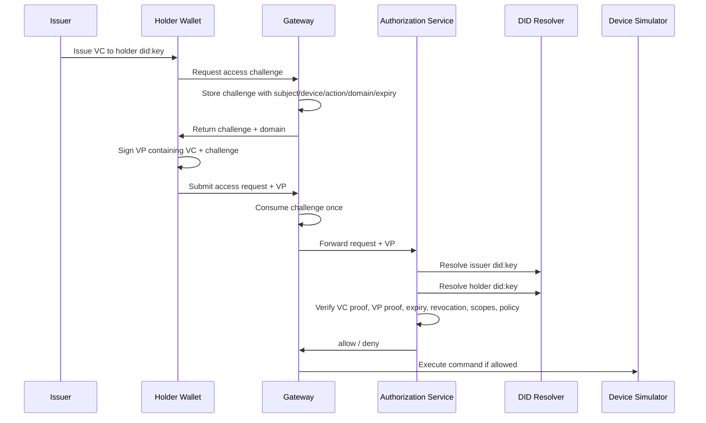

# ADR 0001: Gateway-Mediated SSI Proof of Concept

## In-depth architecture diagram



## Context

Blackwall is a software-only proof of concept for applying Self-Sovereign Identity (SSI) ideas to smart home access control and data mediation.

Most consumer smart devices are resource-constrained, vendor-specific, and unlikely to implement DID resolution, verifiable credential validation, holder wallets, or verifiable presentation protocols directly. The PoC therefore needs to demonstrate SSI-style authorization without requiring changes inside every device simulator.

The current system has five local components:

- Gateway API in Go
- Authorization service in Rust
- Issuer service in Go
- Holder wallet service in Go
- Device simulators in Go

The architecture must remain small enough for local scenario testing while still showing the key SSI control points: issuance, holding, presentation, verification, revocation, delegation, ownership transfer, and local policy.

## Decision

Use a gateway-mediated SSI architecture.

Smart devices stay SSI-unaware. The gateway receives access requests, handles challenge issuance, forwards authorization material to the Rust authorization service, and only calls device simulators after an allow decision.

Use VC-shaped credentials with:

- DID issuers and holder subjects
- `credentialSubject` device/action scopes
- `credentialStatus` for revocation state
- Ed25519 Data Integrity-style proofs

Use a holder wallet service for the holder role.

The wallet owns a holder `did:key`, stores credentials issued to that DID, and signs challenge-bound verifiable presentations. Access through the stronger SSI path uses:

```text
Issuer -> Holder wallet: issue VC to holder did:key
Holder wallet -> Gateway: request access challenge
Gateway -> Holder wallet: return challenge + domain
Holder wallet -> Gateway: submit VP containing VC
Gateway -> Authorization service: forward access request + VP
Authorization service: verify VP, VC, revocation, scopes, and policy
Gateway -> Device simulator: execute only after allow
```

Issuer-side authority-changing operations also require challenge-bound owner presentations. Delegation, revocation, and ownership transfer requests carry an owner VP rather than a raw owner credential, so the issuer verifies both the owner credential and holder control of the owner DID before changing authority state.

Use `did:key` for the initial DID method.

`did:key` keeps DID resolution deterministic and local. It avoids adding a registry, web hosting dependency, or external resolver while still providing a real DID method and a DID document/resolver boundary. The authorization service resolves issuer and holder verification methods through a resolver module instead of accepting raw public keys in the access request.

Use durable, stateful gateway challenges.

The gateway stores issued VP challenges in SQLite with subject, device, action, domain, expiry, and consumption metadata. Challenge values are unique, and consumption is an atomic update that only succeeds for an unconsumed row, so replaying the same VP is denied.

Use SQLite-backed security state and file-backed policy fixtures for the PoC.

Credentials, credential scopes, issuer challenges, delegations, ownership transfers, and revocations are represented in `runtime/issuer/issuer.db`. Gateway challenges, access attempts, audit events, device executions, and sensor readings are represented in `runtime/gateway/gateway.db`. Wallet-held credentials and wallet/key metadata are represented in `runtime/wallet/wallet.db`. Device policy remains represented by `configs/policies/devices.json` as a simple, inspectable fixture for local scenario runs.

## Consequences

### Benefits

- Devices remain simple and SSI-unaware.
- The gateway becomes the local sovereignty and mediation point.
- The PoC now has recognizable issuer, holder, verifier, and subject roles.
- `did:key` provides real DID-derived verification keys without network dependencies.
- Challenge-bound VPs prove holder control of the holder DID key.
- Issuer-side authority changes prove holder control with challenge-bound owner VPs instead of raw credential submission.
- One-time durable challenge consumption gives basic replay protection across process restarts.
- Transactional SQLite state makes revocation, ownership transfer, audit, and challenge handling easier to inspect and less prone to partial writes.
- Local files keep policy easy to inspect during demos.

### Trade-offs

- `did:key` is less operationally realistic than `did:web` or registry-backed DID methods for issuer governance.
- The wallet is still a local demo service, not a production wallet.
- Challenge state is not shared across multiple gateway instances.
- Revocation is custom and SQLite-backed, not a standards-aligned Status List implementation.
- SQLite is local-process friendly but is not a distributed state backend for multi-gateway deployments.
- Proof handling is pragmatic JSON signing, not full VC Data Integrity canonicalization.
- The authorization service is still mostly a PoC verifier, not a general-purpose SSI verifier.

### Security Notes

The current VP flow checks:

- VP holder matches the request subject.
- VP proof challenge matches the gateway-issued challenge.
- VP proof domain matches the gateway domain.
- Challenge subject/device/action match the access request.
- Challenge is consumed once.
- VC subject matches the VP holder.
- VC issuer matches the trusted issuer DID.
- VC and VP signatures verify through DID resolution.
- Delegation, revocation, and ownership-transfer requests use issuer challenges and owner VPs.
- Credential expiry, revocation, scopes, and local policy are enforced.

The current PoC does not yet provide:

- Multi-gateway challenge replication.
- Full DID method support beyond `did:key`.
- Standards-aligned Status List revocation.
- Selective disclosure.
- Production key storage or recovery.

## Follow-Up Decisions

Likely next ADRs:

- Whether to add `did:web` for issuer identity.
- Whether to replace SQLite-backed revocation with a Status List model.
- Whether to introduce a real presentation exchange protocol.
- How to model local household policy management.
