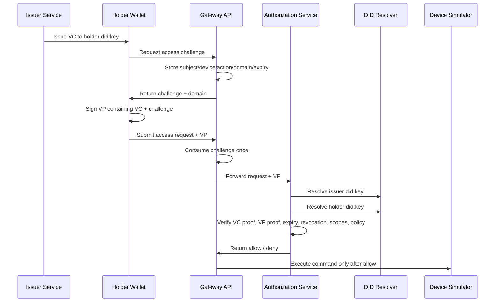

# ADR 0001: Gateway-Mediated SSI Smart Home Proof of Concept

## Status

Accepted.

## Scope

This ADR defines the architecture for a local, software-only proof of concept that applies Self-Sovereign Identity (SSI) concepts to smart home access control and data mediation.

The project demonstrates how a locally controlled gateway can enforce identity-aware authorization for smart devices without requiring each device to implement SSI protocols.

## Context

Consumer smart home devices are typically heterogeneous, vendor-specific, and resource-constrained. Requiring each device to resolve DIDs, verify verifiable credentials, validate verifiable presentations, track revocation, and enforce household policy would make adoption unrealistic and would duplicate security-sensitive logic across many devices.

The proof of concept therefore places SSI and authorization logic at the gateway boundary. The gateway acts as the mediation point between users, credentials, local policy, and device execution. Devices remain simple HTTP simulators. The authorization service performs credential and presentation verification. The issuer and holder wallet model the credential lifecycle.

The architecture is designed to show these SSI control points:

- credential issuance
- credential holding
- challenge-bound presentation
- credential and presentation verification
- local policy enforcement
- delegation
- revocation
- ownership transfer
- mediated device execution
- data-flow persistence and auditability

The implementation is intentionally local-first. It favors inspectable state, deterministic keys for scenarios, and reproducible commands over distributed infrastructure.

## Decision Summary

The project uses a gateway-mediated SSI architecture with five service roles:

- Gateway API in Go
- Authorization service in Rust
- Issuer service in Go
- Holder wallet service in Go
- Device simulators in Go

The gateway issues one-time access challenges, consumes them atomically, forwards challenge-bound verifiable presentations to the authorization service, and executes device actions only after an allow decision.

The authorization service verifies VC and VP proofs, credential expiry, revocation state, credential scope, and local policy. The issuer creates owner and delegation credentials and handles revocation and ownership transfer. The holder wallet owns a holder `did:key`, stores credentials, and signs verifiable presentations.

SQLite stores runtime security state. A JSON fixture stores local device policy. Scenario runners, smoke commands, unit tests, and CI validate the proof of concept.

## Architecture



## Decision 1: Keep Smart Devices SSI-Unaware

### Decision

Smart devices do not implement SSI. They expose simple local HTTP interfaces such as lock, unlock, turn light on, turn light off, and read sensor.

### Rationale

SSI verification requires DID resolution, signature verification, credential validation, revocation checks, presentation challenge validation, and policy evaluation. Embedding this logic in each device would increase complexity, duplicate sensitive code, and make the architecture dependent on each device vendor or device class.

Keeping devices SSI-unaware makes the gateway the single enforcement boundary. This matches the project goal: demonstrate that smart-home sovereignty can be improved through a locally controlled mediation point rather than through SSI-capable devices.

### Consequences

- Device simulators remain small and easy to replace.
- Authorization logic is centralized at the gateway/authz boundary.
- Device compromise is not treated as equivalent to authorization compromise.
- The gateway becomes security-critical and must mediate all device access paths.

## Decision 2: Use the Gateway as the Local Mediation Point

### Decision

The Gateway API receives access requests, issues challenges, persists challenge state, forwards presentations to the authorization service, writes audit/runtime records, and executes device actions after authorization succeeds.

### Rationale

The gateway is the natural control point in a smart-home architecture. It can observe both identity-side requests and device-side execution. It can enforce local policy before commands leave the household boundary. It can persist audit events and data-flow records without requiring each device to understand credentials.

Gateway mediation also gives the holder a stable domain for challenge-bound presentations. The holder signs a VP for a specific gateway challenge and domain, and the gateway consumes that challenge exactly once.

### Consequences

- The gateway controls replay protection for access requests.
- The gateway can log attempted and successful access independently of device behavior.
- The gateway can mediate both command-style actions and data-flow actions.
- Direct device access remains outside the PoC security model.

## Decision 3: Split Authorization into a Rust Service

### Decision

Credential and presentation verification lives in a separate Rust authorization service.

### Rationale

Authorization verification is security-sensitive and benefits from a narrow service boundary. Separating it from the Go gateway keeps the gateway focused on HTTP mediation, challenge persistence, audit logging, and device execution. It also makes verifier behavior easier to test independently.

Rust is used for the authorization service to model a compact verifier with strong typing around credential structures, presentation structures, DID resolution, and decision reasons.

### Consequences

- The gateway delegates allow/deny decisions to one internal service endpoint.
- Verification logic can be tested without starting device simulators.
- The service boundary introduces local HTTP dependency between gateway and authz.
- Request and credential schemas must remain aligned between Go and Rust components.

## Decision 4: Use VC-Shaped Credentials

### Decision

Authorization data is represented as VC-shaped JSON credentials containing:

- `@context`
- `id`
- `type`
- `issuer`
- `validFrom`
- `validUntil`
- `credentialSubject`
- `credentialStatus`
- `proof`

The credential subject carries:

- holder DID
- gateway identifier
- device scopes
- action scopes
- delegation lineage when applicable
- ownership-transfer lineage when applicable

### Rationale

The credential model keeps the PoC close to SSI vocabulary while avoiding the burden of full standards compliance. Device and action scopes are explicit, inspectable, and easy to validate. Credential status gives the authorization service a revocation hook. Proofs let the issuer bind credential contents to its DID key.

### Consequences

- Credentials are readable JSON artifacts.
- Authorization decisions can explain denials by issuer, subject, expiry, revocation, device scope, action scope, or policy.
- The proof model is pragmatic JSON signing rather than full VC Data Integrity canonicalization.
- Standards-aligned interoperability is not claimed.

## Decision 5: Use Ed25519 Data Integrity-Style Proofs

### Decision

Credentials and presentations use Ed25519 signatures with proof objects shaped like Data Integrity proofs:

- `type`
- `cryptosuite`
- `created`
- `verificationMethod`
- `proofPurpose`
- `challenge` and `domain` for VPs
- `proofValue`

### Rationale

Ed25519 is compact, widely supported, and straightforward for local proof-of-concept verification. Data Integrity-style proof fields make the security purpose of each signature explicit:

- issuer credentials use `assertionMethod`
- holder presentations use `authentication`

The implementation signs JSON after removing the proof field. This provides deterministic local behavior for the project’s own services and tests.

### Consequences

- The PoC demonstrates issuer assertions and holder authentication.
- Proof validation is simple enough to inspect.
- Full RDF canonicalization and broad VC interoperability are outside scope.
- Any production version would need a standards-aligned proof suite and canonicalization strategy.

## Decision 6: Use `did:key` for Issuer and Holder Identity

### Decision

Issuer and holder identities use `did:key` with Ed25519 public keys.

### Rationale

`did:key` makes DID resolution deterministic and local. It avoids registries, web hosting, network lookup, and external resolver dependencies while still preserving the DID abstraction. The authorization service resolves verification methods through a resolver boundary rather than accepting raw public keys from requests.

This lets the PoC demonstrate DID-based verification without turning the project into DID infrastructure.

### Consequences

- Scenario runs do not depend on external networks or registries.
- DID documents can be derived from DID strings.
- The resolver boundary can be replaced by `did:web` or another DID method in a production design.
- Key rotation, issuer governance, and DID lifecycle management are outside scope.

## Decision 7: Require Challenge-Bound Verifiable Presentations

### Decision

Access requests require a verifiable presentation containing exactly one credential. The VP proof must bind to:

- holder DID
- gateway-issued challenge
- gateway domain

The gateway stores each challenge with subject, device, action, domain, expiry, creation time, consumption time, and consumption result.

### Rationale

Raw credential submission proves possession of credential data, but it does not prove holder control of the DID key or freshness of the request. A challenge-bound VP proves that the holder signed a presentation for a specific gateway request. The gateway’s one-time challenge consumption prevents replay of the same signed presentation.

Binding the challenge to subject, device, and action prevents a valid VP from being reused for a different request shape.

### Consequences

- Access requires both a valid credential and proof of holder control.
- Replay is denied by durable gateway state.
- Expired, mismatched, unrecognized, or already consumed challenges are denied before device execution.
- The gateway must maintain challenge state.

## Decision 8: Require Owner VPs for Authority-Changing Issuer Operations

### Decision

Issuer-side delegation, revocation, and ownership-transfer operations require challenge-bound owner presentations. The issuer issues its own challenges for these operations and validates owner VPs before changing authority state.

### Rationale

Delegation, revocation, and ownership transfer mutate authorization authority. These operations should not rely on raw owner credential submission. Requiring owner VPs proves that the requester controls the DID associated with the owner credential at the time of the operation.

Issuer challenges are separate from gateway access challenges because they bind to issuer operations rather than device access.

### Consequences

- Delegation proves owner control before creating a delegated credential.
- Revocation proves owner control before revoking a target credential.
- Ownership transfer proves owner control before replacing owner authority.
- The issuer maintains durable challenge and authority-change state.

## Decision 9: Model Delegation with Scoped Credentials

### Decision

Delegation creates a `DelegationCredential` for another subject. Delegated credentials include:

- delegated subject DID
- delegating owner DID
- parent owner credential ID
- gateway
- device scopes
- action scopes
- expiry

### Rationale

Delegation should be explicit, inspectable, scoped, and revocable. The delegated credential carries lineage back to the owner authority and limits what the delegated subject can do.

The issuer rejects delegation requests whose device or action scopes are not subsets of the owner credential scopes.

### Consequences

- Delegated users can be allowed for one action while denied for another.
- Delegation remains compatible with the same authorization path as owner credentials.
- Revoking the delegated credential removes delegated access.
- More complex delegation graphs are outside scope.

## Decision 10: Model Revocation with SQLite State

### Decision

Revocation state is stored in `runtime/issuer/issuer.db` and queried by the authorization service.

### Rationale

The PoC needs revocation-aware authorization without introducing a hosted revocation list or registry. SQLite provides durable local state that is easy to inspect during scenario runs. The authorization service checks whether a credential ID appears in the revocation table before allowing access.

### Consequences

- Revocation persists across process restarts.
- Scenario outcomes can demonstrate pre-revocation allow and post-revocation deny.
- Revocation is custom and local, not a standards-aligned Status List implementation.
- A production design would need a revocation model suitable for distribution and verification.

## Decision 11: Model Ownership Transfer as Revoke-and-Reissue

### Decision

Ownership transfer revokes the previous owner credential and issues a replacement owner credential for the new subject. The replacement credential records transfer lineage.

### Rationale

Ownership transfer changes the root authority for a device or gateway scope. Revoke-and-reissue makes that transition explicit:

- the old owner credential is no longer valid
- the new owner credential carries fresh authority
- lineage records who transferred authority and which credential was replaced

### Consequences

- Old-owner requests are denied after transfer.
- New-owner requests are allowed with the replacement credential.
- Transfer history can be inspected in issuer state.
- Shared or multi-owner household authority is outside scope.

## Decision 12: Use SQLite for Runtime State

### Decision

Runtime state is stored in local SQLite databases:

- `runtime/gateway/gateway.db`
- `runtime/issuer/issuer.db`
- `runtime/wallet/wallet.db`

Gateway state includes access challenges, audit events, access attempts, device executions, and sensor readings.

Issuer state includes credentials, credential scopes, issuer challenges, revocations, delegations, and ownership transfers.

Wallet state includes stored credentials, wallet metadata, and key metadata.

### Rationale

SQLite gives the PoC durable state without requiring external services. It supports transactions for challenge consumption, revocation, and ownership transfer. It is easy to inspect during evaluation and easy to reset between runs.

### Consequences

- Scenario state persists across service restarts.
- Runtime artifacts are local and ignored by version control.
- The architecture does not model distributed state.
- SQLite is a local PoC storage choice, not a multi-gateway backend.

## Decision 13: Use a JSON Local Policy Fixture

### Decision

Device policy is represented by `configs/policies/devices.json`. The authorization service reads this fixture to decide whether a requested action is locally allowed for a device.

The `scenarios/policyctl` command lists and updates this fixture.

### Rationale

Local policy is a key sovereignty mechanism: even valid credentials should be constrained by household rules. A JSON fixture keeps policy easy to inspect, commit, and modify for scenario runs. A CLI gives basic management without adding policy administration APIs.

### Consequences

- Policy enforcement is visible and deterministic.
- Tests can cover policy denial.
- Policy semantics are limited to device action allowlists.
- Authenticated runtime policy administration is outside scope.

## Decision 14: Mediate Data Flows Through the Gateway

### Decision

Sensor reads are mediated through the same access request and authorization path as command-style device actions. Allowed sensor reads are persisted in gateway state.

### Rationale

Smart-home sovereignty is about both commands and data. Sensor reads demonstrate that the gateway can mediate data access, not only actuator control. Persisting readings through the gateway gives an audit path for household data access.

### Consequences

- Data-flow mediation uses the same credential, VP, challenge, revocation, scope, and policy checks as commands.
- Sensor readings are stored in `gateway.db`.
- More complex data minimization, retention, and redirection policies are outside scope.

## Decision 15: Provide Scenario Runners and Smoke Validation

### Decision

The project includes:

- interactive orchestrator
- standalone scenario commands
- non-interactive smoke command
- measurement command
- top-level `make check`, `make smoke`, `make smoke-all`, `make measure`, `make policy-list`, and `make reset`
- CI workflow that runs Go checks, Rust checks, and all-device smoke validation

### Rationale

The architecture involves multiple services and cross-service state. Manual API calls are too error-prone for repeatable validation. Scenario runners encode expected flows and outcomes. Smoke validation proves that services compose correctly. Unit tests cover sensitive local behavior.

### Consequences

- The PoC can be validated with a small number of commands.
- CI exercises every device adapter path.
- Measurement output provides basic feasibility timings.
- The project does not define formal performance thresholds.

## Decision 16: Treat Production Hardening as Outside Scope

### Decision

The proof of concept does not implement production-grade SSI, wallet, policy, or distributed-system capabilities.

### Rationale

The project goal is architectural demonstration. Adding production-grade concerns would obscure the gateway-mediated SSI pattern and substantially increase implementation surface.

### Explicit Non-Goals

- production wallet/key storage and recovery
- full VC Data Integrity canonicalization
- selective disclosure
- DID methods beyond `did:key`
- standards-aligned Status List revocation
- authenticated runtime policy administration
- multi-gateway challenge/state replication
- distributed state storage
- formal OpenAPI specifications
- release-blocking performance thresholds

## Security Properties

The implemented flow enforces these properties:

- Request subject must match VP holder.
- VP credential subject must match VP holder.
- VP proof challenge must match the request challenge.
- VP proof domain must match the gateway domain.
- Gateway challenge subject, device, and action must match the access request.
- Gateway challenges are consumed once.
- Credential issuer must match the trusted issuer DID.
- Credential and presentation signatures must verify through DID resolution.
- Credential validity window must include the request time.
- Credential must not be revoked.
- Device scope must include the requested device.
- Action scope must include the requested action.
- Local policy must allow the requested device/action pair.
- Issuer-side authority changes require issuer challenges and owner VPs.

## Consequences

### Benefits

- SSI logic is centralized at the gateway/authz boundary.
- Devices remain simple and replaceable.
- Holder control is proven through challenge-bound VPs.
- Revocation and ownership transfer are visible in durable state.
- Local policy can deny requests even when credentials are valid.
- Audit and runtime state are inspectable.
- Scenario validation is reproducible locally and in CI.

### Trade-Offs

- The gateway is a critical trust and enforcement point.
- `did:key` avoids infrastructure but does not model issuer governance.
- SQLite is inspectable and durable but not distributed.
- JSON policy is simple but not expressive.
- Proof handling is pragmatic and not broadly interoperable.
- Scenario timings are useful for feasibility but not rigorous benchmarks.

## Validation

The repository validates the ADR through:

- unit tests for authorization edge cases
- unit tests for gateway challenge/replay behavior
- unit tests for issuer issuance and bad owner VP rejection
- unit tests for wallet storage and VP signing
- all-device smoke scenarios for sensor, lock, and light
- CI checks for Go formatting, Go tests, Go vet, Rust formatting, Rust check, Rust clippy, Rust tests, and all-device smoke

Primary commands:

```bash
make check
make smoke-all
make policy-list
make measure
make reset
```

## Closure

This ADR closes the PoC architecture. Further productization should be designed in separate ADRs rather than extending this demonstration scope.